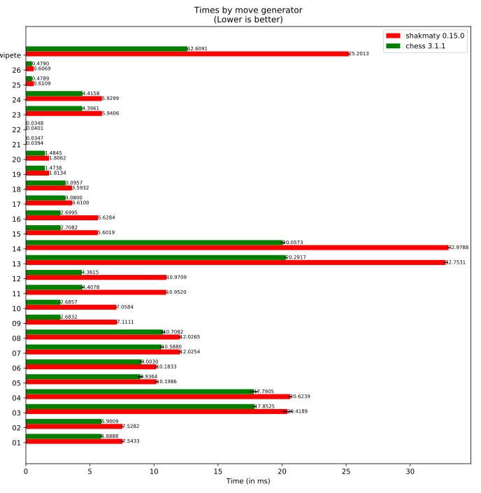

# Perft Test Benchmarks for crates.io/chess/, crates.io/shakmaty/ and crates.io/chess-move-gen

This simple program tests the performance of the 'chess' crate, the 'shakmaty' crate and the 'chess-move-gen' crate.

## Compiling

This library now requires the nightly compiler to support the 'chess-move-gen' crate.

Other than that, compiling this application should be as easy as:

```bash
cargo build --release
```

## Running

To run the program, you must specify a valid FEN string (representing a chess position) and a depth to search.

The program will report the number of leaf nodes it found starting at that position, and the amount of time it took to search (ignoring setup time, which currently is a lot).

You can also use the -a [size] option to cache results at each depth, speeding up perft performance.

You can also use the -m option to use the MoveGen structure, which is an iterator to test its functionality.  (This is now the fastest way to generate moves, in most cases, for the 'chess' crate.)

You can also specify the -c option to use the 'chess' crate, the -s option to use the 'shakmaty' crate, or the -g for the 'chesss-move-gen' crate.  Note: not all of the features supported by this application are in the 'shakmaty' crate, so I default to calling their 'perft' function for all command-line arguments.

# Performance

Below I compare the performance numbers (using the command 'RUSTFLAGS="-C target-cpu=native" cargo bench | python graph_benches.py') of chess, chess-move-gen, and shakmaty (lower is better).

Very important note: chess-move-gen performs much better on Intel CPU's than listed here.  Based on my memory, it was in the same range as 'chess', faster on some positions, but slower on others.  I will update the performance.svg file when I have time.  This was run on a Ryzen 5.

I specifically ran chess-move-gen 0.6.3 to avoid the BMI2 slowdown on AMD processors that many chess programmers noticed.  This may be handled internally by the crate - I'm not sure.



If viewing on crates.io, you can view the performance numbers on https://github.com/jordanbray/chess_perft.

## Example

```bash
[jordan@razer chess_perft]$ ./target/release/chess_perft -f "r3k2r/p1ppqpb1/bn2pnp1/3PN3/1p2P3/2N2Q1p/PPPBBPPP/R3K2R w KQkq - 0 1" -d 6 -m # Test the KiwiPete Position
chess   : Perft 6 of r3k2r/p1ppqpb1/bn2pnp1/3PN3/1p2P3/2N2Q1p/PPPBBPPP/R3K2R w KQkq - 0 1       Result: 8031647685      Time: 22s 492ms
```

